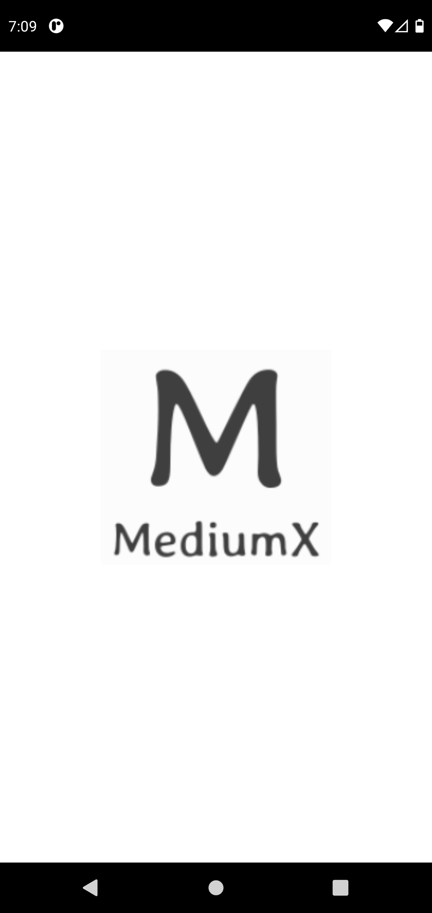
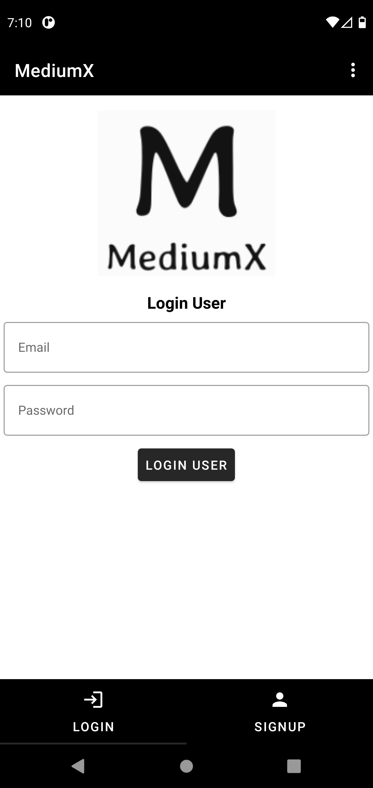
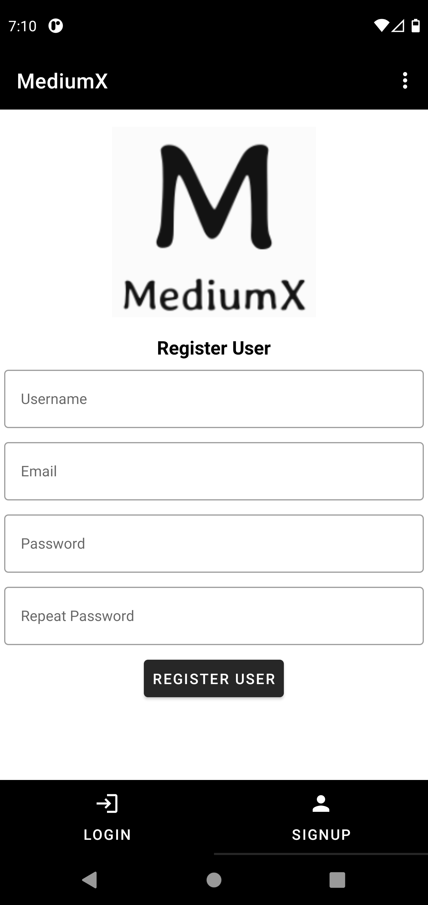
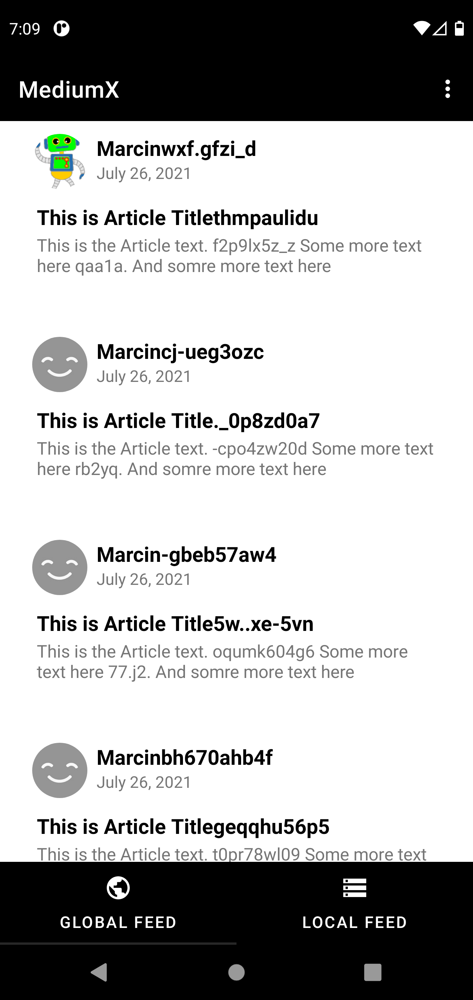
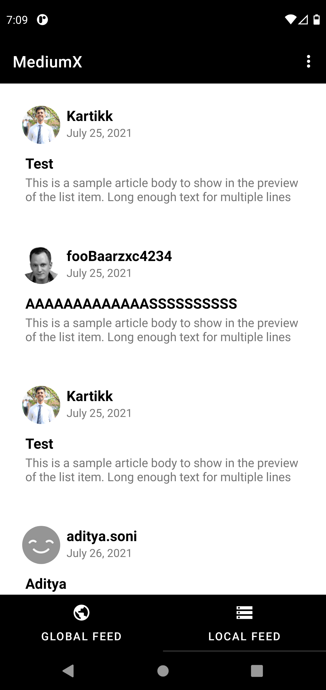
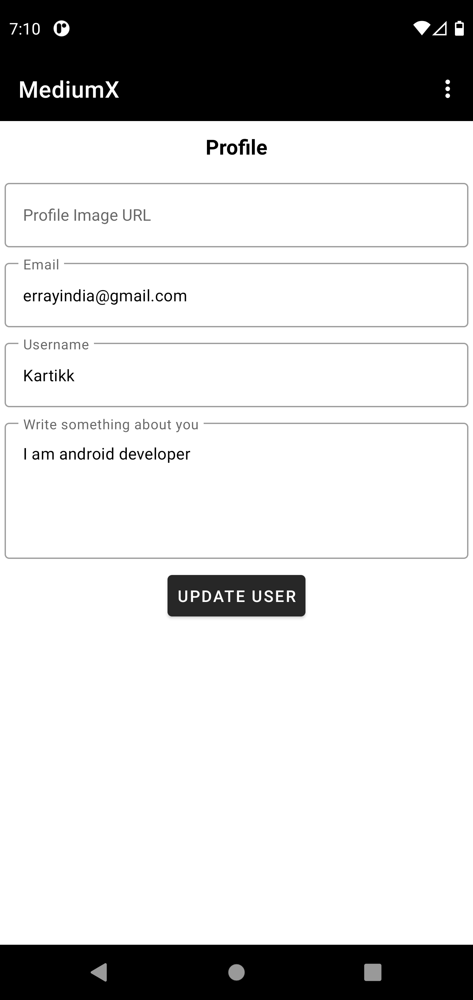
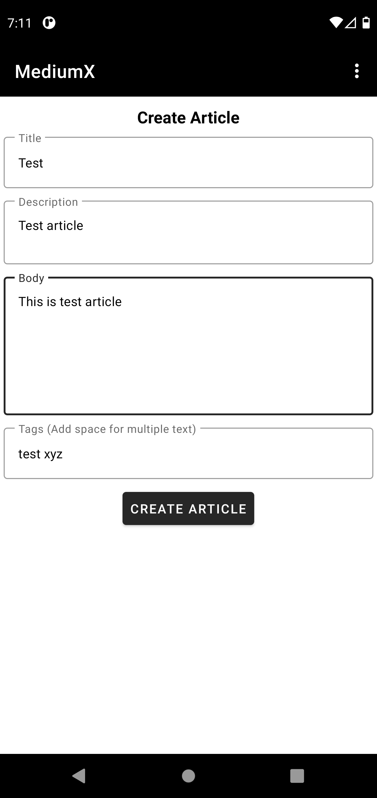
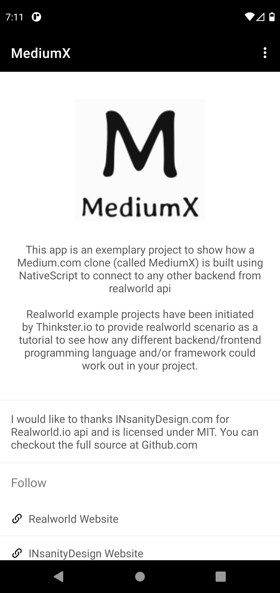
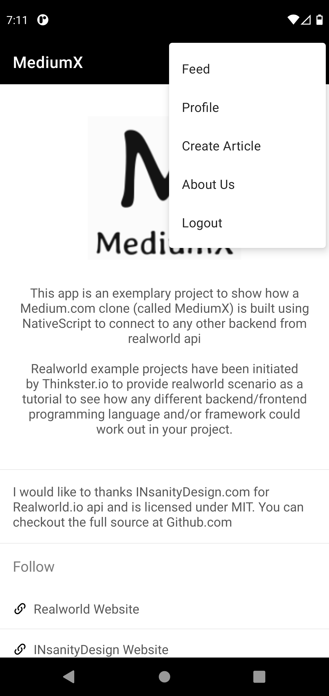

# MediumX - Android App
[

](./readme/logo.png)  

## About

This app is an exemplary project to show how a [Medium.com](https://medium.com/) clone (called MediumX) is built using NativeScript to connect to any other backend from realworld api

Realworld example projects have been initiated by [Thinkster.io](https://thinkster.io/) to provide realworld scenario as a tutorial to see how any different backend/frontend programming language and/or framework could work out in your project.

I would like to thanks [INsanityDesign.com](https://insanitydesign.com/) for [Realworld.io](https://github.com/gothinkster/realworld) api and is licensed under MIT. You can checkout the full source at Github.com

### [Video Demo](https://youtu.be/hhR3xYOEwWg)

## Libraries Used
- Retrofit
- Jetpack Navigation
- Paging 3
- Lifecycle
- Kotlin Coroutines
- Okhttp Interceptor
- Awesome Validation
- Glide

## Screenshots
- Splash Screen  

- Auth Screen - User can login to already existing account or register a new account  

- Feed Screen - User can view Global Feed (i.e. all online uploaded articles) and can store articles to local storage. 

- Profile Screen - Already logged in user's can update their profile details. 

- Create Article Screen - Logged in user's can write their own articles. 

- About Us Screen - Details of app is displayed here. 

- Logout Navigation - Profile and Create Article options are displayed when user is logged in. Else only Login/Signup option is displayed.  

## Permissions

On Android versions prior to Android 5.0, MediumX requires the following permissions

- Full Network Access
- View Network Connections
- Read and write access to external storage

The network access permissions are made use of for downloading content and making API requests. The external storage permissions is used to cache articles for viewing offline.